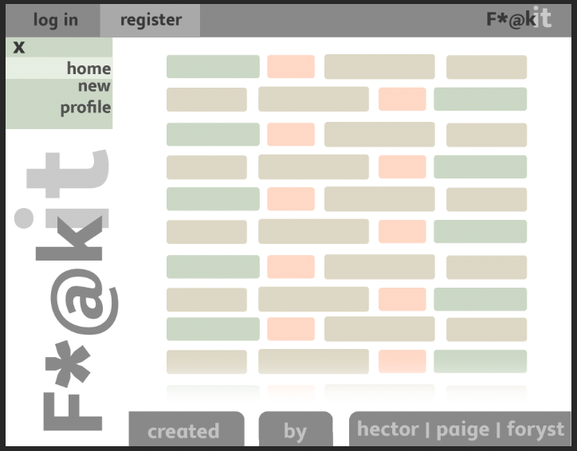
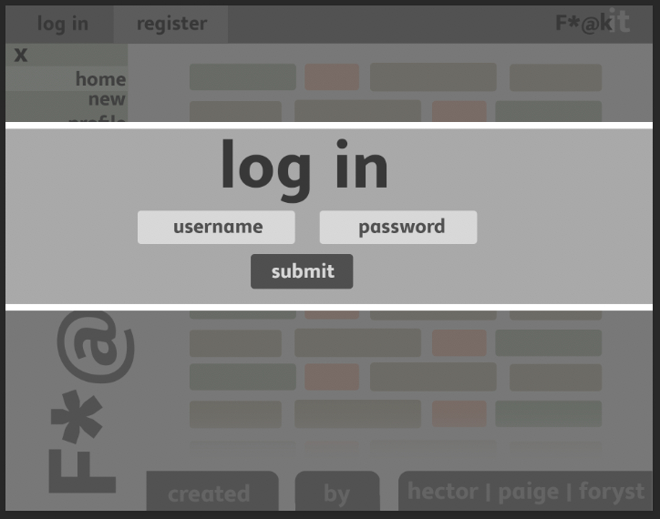
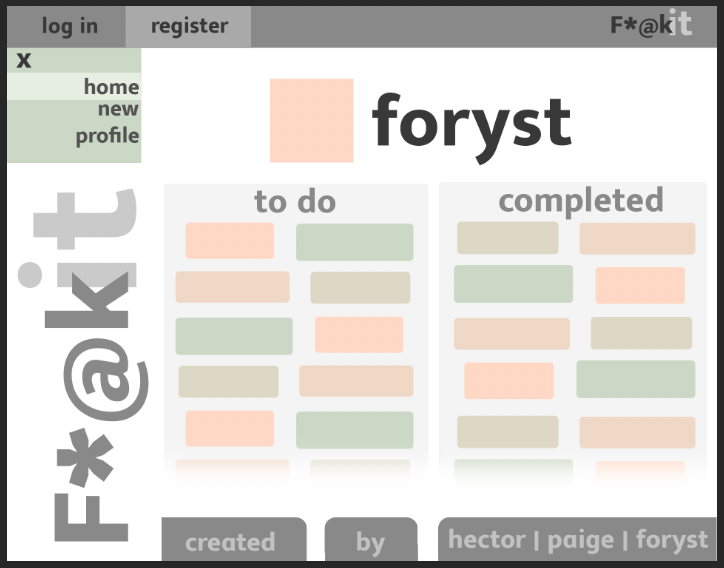
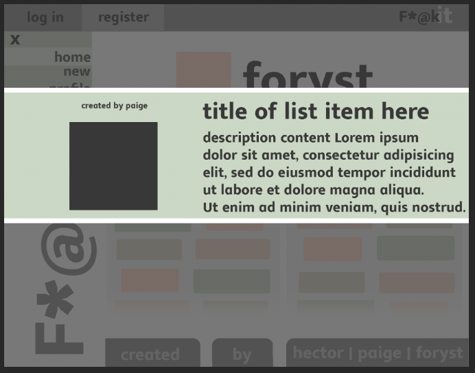
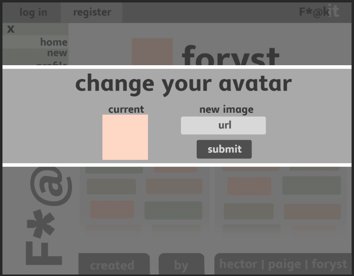

# F*@kIt

The bucket list to end all other bucket lists ... the F*@kIt list! You've got big plans for yourself, but there are always haters out there telling you what you can or cannot do. It's time to say f*@k it and go after your dreams. With this app, you'll be able to store and track the completion of the things you want to experience in life.

### Deployment

Heroku is a cloud platform that was used to host our web application. To view the live site, visit
https://bucket-list-app-frontend.herokuapp.com/

### Technologies Used

- HTML
- CSS
- JavaScript
- AngularJS
- Ruby on Rails
- PostgreSQL
- Atom

## Getting Started
Start by making an account. This will allow you full access to the app, including others' F*@kIt lists. For example:

- username: spaceghost
- password: spaceghost (max 72 characters)

From here, you have the ability of creating items for your own F*@kIt list, deleting them, and marking them as completed.

## Planning and Wireframes

          
#### Home Page

#### Log In Page

#### Profile

#### Bucket Goal

#### Update Avatar

Some important goals for us were:
- recognizing the user that is logged in, and incorporating other functionality around logged-in users
- removing the ability to affect other profiles
- requiring username and password to reach the site

### Authors

#### Paige Boyer https://github.com/paige1381
#### Foryst Jankela https://github.com/forystj
#### Hector Guevara https://github.com/hectorlito

## Future Goals
-  To allow users to share F*@kIt lists and individual items on their lists amongst each other
-  The concept of public and private F*@kIt list items

### Credits and Thank you
* Dan
* Karolin
* Thom
* Everyone who worked together to figure out Authorization/Authentication
